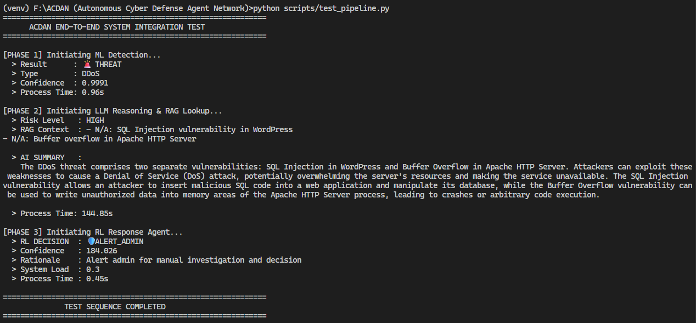
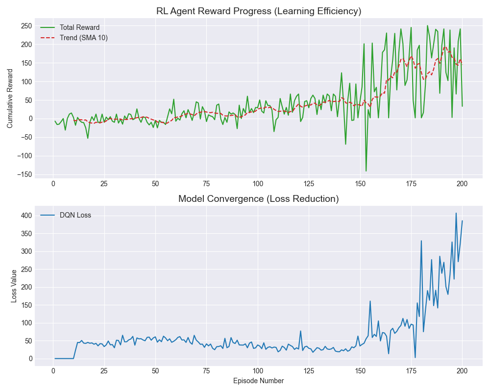

# ACDAN: Autonomous Cyber Defense Agent Network
[](https://www.python.org/downloads/) 
[](https://opensource.org/licenses/MIT)
[](https://django-ninja.rest-framework.com/)

ACDAN is an end-to-end, multi-agent cybersecurity framework designed to automate the **Detect-Reason-Respond** lifecycle. It bridges the gap between raw traffic analysis and executive mitigation by combining Deep Learning, RAG-powered LLMs, and Reinforcement Learning into a unified autonomous pipeline.

---

## ⚡ Core Features
- **Adaptive Detection:** PyTorch-based DNN achieving high accuracy on 79 bi-directional flow features.
- **Contextual Reasoning:** RAG-enabled Mistral LLM (via Ollama) providing expert-level threat summaries and CVE cross-referencing.
- **Autonomous Mitigation:** Deep Q-Network (DQN) agent that learns optimal responses (Block/Limit/Alert) based on network state.
- **Resource-Efficient:** Built-in data engineering scripts to handle massive datasets on consumer-grade hardware.

---

## 🛠️ Tech Stack
- **Inference Engine:** PyTorch (Deep Learning), Scikit-learn (Preprocessing)
- **Knowledge Base:** FAISS (Vector DB), Sentence-Transformers
- **Reasoning:** Ollama (Mistral-7B 4-bit)
- **RL Environment:** Custom OpenAI Gym-style Network Defense Env
- **Backend:** Django + Django Ninja 

---

## 🚀 The Pipeline Architecture
ACDAN operates as a sequential "Sense-Think-Act" loop:

<p>

1. **Phase 1 (Detection):** Monitors traffic via a Deep Neural Network to identify anomalies.
2. **Phase 2 (Reasoning):** Uses **Retrieval-Augmented Generation (RAG)** to fetch CVE context and generate human-readable threat intelligence.
3. **Phase 3 (Response):** A **DQN Agent** selects the best mitigation strategy to minimize system load while stopping the threat.

---

## 📂 Project Structure 
 > only necessary things are included

```text
ACDAN (Autonomous Cyber Defense Agent Network)/
├── acdan_main/             # Django Project configuration & routing
├── apps/
│   ├── detection/          # ML-based Threat Detection Layer
│   │   ├── ml_logic/       # Model architecture & Inference pipeline
│   │   ├── api.py          # REST API endpoints
│   │   └── services.py     # Orchestration between ML and DB
│   ├── reasoning/          # Contextual Analysis Layer (RAG)
│   │   ├── rag_logic/      # LLM prompts & Threat analysis logic
│   │   └── services.py     # RAG workflow management
│   ├── response/           # Autonomous Mitigation Layer (RL)
│   │   ├── rl_logic/       # Deep Q-Network (DQN) & Defense Environment
│   │   └── services.py     # RL Agent decision execution
│   └── rag_intelligence/   # Shared RAG utilities (FAISS, Embeddings)
├── data/
│   ├── cve_db/             # Local Vulnerability database (JSON/FAISS)
│   ├── models/             # Production-ready ML/RL model weights (.pt)
│   └── processed/          # Structured datasets for training
├── scripts/                # Maintenance, Training, and Testing utilities
│   ├── initialize_rag.py   # Setup vector database
│   ├── train_rl_agent.py   # RL Model training script
│   └── test_pipelines.py   # End-to-end system testing
├── manage.py               # Django management CLI
└── requirements.txt        # Project dependencies
```
---

## 📈 Performance & Reproducibility

### RL Training Convergence
The RL agent transitions from random exploration to high-reward mitigation strategies within 200 episodes.

<p>
 
> **Developer Note:** On 8GB RAM,876,305 samples from the [CIC-IDS-2017 Dataset](https://www.kaggle.com/datasets/chethuhn/network-intrusion-dataset) were balanced using [`create_balanced_data.py`](scripts/create_balanced_data.py).  
> The resulting accuracy and latency show a dedicated effort for autonomous defense on constrained hardware.

| Metric | Result |
| :--- | :--- |
| **Detection Accuracy** | 86.76% (Validated on 876K Balanced Samples) |
| **Inference Latency (ML)** | ~0.8s |
| **Reasoning Latency (LLM)** | (shown higher in my Local 4-bit Quantized) |
| **Feature Set** | 79 Bi-directional Flow Features |
| **Hardware Environment** | 8GB RAM / 4GB VRAM (Single Node) |

---

## 🛠️ Edge-Optimization & Data Engineering
To maintain high performance on limited hardware, ACDAN implements:
- **Strategic Subsampling:** A custom pipeline processes the massive CIC-IDS-2017 dataset into a manageable 876k record set using a 40k-cap per class to ensure system stability.
- **Vectorized Intelligence:** FAISS index enables sub-millisecond retrieval of CVE context without taxing system memory.
- **Quantized Reasoning:** 4-bit Mistral via Ollama allows expert-level analysis within a 4GB VRAM envelope.

---

## ⚡ Quick Start

### 1. Environment Setup & Data Preparation
```bash
# Install dependencies
pip install -r requirements.txt

# Process the CIC-IDS-2017 dataset into a balanced format
python scripts/create_balanced_data.py

# Initialize the FAISS Vector Database with CVE intelligence
python scripts/initialize_rag.py
```

### 2. Model Training
```bash
# Train the Detection Agent (Generates best_model.pt)
python apps/detection/ml_logic/trainer.py --dataset data/processed/balanced_data.csv --epochs 10

# Train the Response Agent (Generates rl_policy.pt)
python scripts/train_rl_agent.py
```

### 3. Execution
```bash
# Terminal 1: Start Ollama (Mistral)
ollama serve
ollama pull mistral

# Terminal 2: Start ACDAN API
python manage.py runserver

# Terminal 3: Run the End-to-End Integration Test
python scripts/test_pipeline.py
```

---

## 🗺️ Roadmap & Future Work
- [ ] Phase 4: Real-time packet interception via eBPF
- [ ] UI: React-based dashboard for real-time threat visualization
- [ ] Distributed: Multi-node agent collaboration for large-scale networks

---

## 🤝 Contributing
<p align="center">
<strong>ACDAN is an open-source research project.</strong><br>
Feel free to fork, submit issues, or contribute improvements.
</p>
